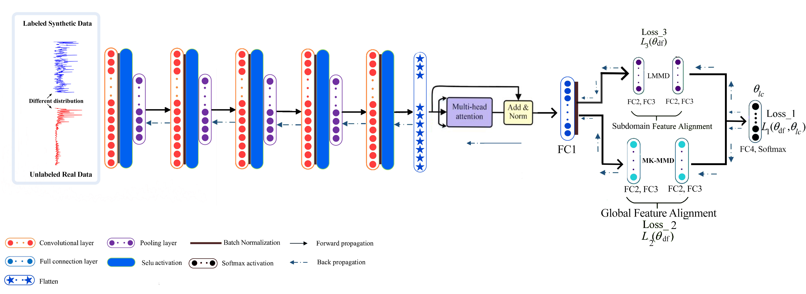
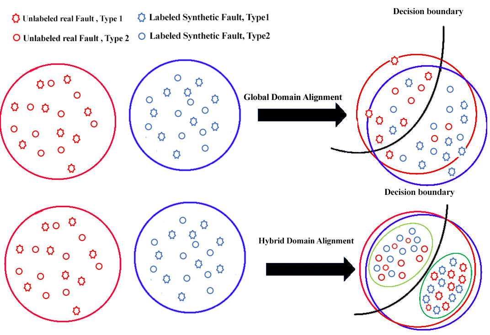
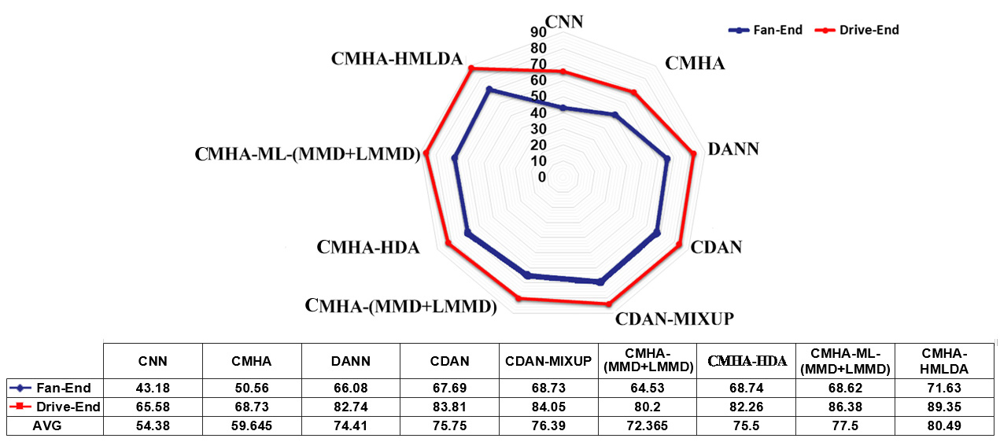

# Synthetic-to-Real Bearing Fault Diagnosis via Convolutional Multi-Head Attention and Hybrid Domain Alignment
> Official implementation of the IEEE ICSPIS 2021 paper: "Synthetic to Real Framework based on Convolutional Multi-Head Attention and Hybrid Domain Alignment".

> **CMHA-HMLDA** — an unsupervised synthetic-to-real framework that trains on labeled *synthetic* bearing data and diagnoses *unlabeled real* faults, using a convolutional multi-head attention feature extractor and a hybrid (global + local) multi-layer domain alignment loss.

<p align="left">
  <a href="https://doi.org/10.1109/ICCIA54998.2022.9737184"></a>
  <a href="https://ieeexplore.ieee.org/document/9737184"></a>
  
  
  
</p>

**Authors:** Mohammadreza Ghorvei¹, [Mohammadreza Kavianpour](https://github.com/kavianpour)¹, Mohammad T. H. Beheshti¹ \*, Amin Ramezani¹

¹ Department of Electrical and Computer Engineering, *Tarbiat Modares University*, Tehran, Iran
\* Corresponding author

Published in the **2022 8th International Conference on Control, Instrumentation and Automation (ICCIA)**, IEEE.
DOI: [10.1109/ICCIA54998.2022.9737184](https://doi.org/10.1109/ICCIA54998.2022.9737184)

---

## TL;DR

Unsupervised domain adaptation for fault diagnosis needs labeled faulty data — which is rarely available in the real world — and most methods align only the *global* distribution, leaving local (sub-domain) gaps. **CMHA-HMLDA** trains on labeled *synthetic* bearing data and adapts to *unlabeled real* data, using a convolutional multi-head attention feature extractor and a **hybrid** loss (MK-MMD for global + LMMD for local) applied across **multiple layers**. On synthetic→real CWRU it reaches **89.35 %** (drive-end) and **71.63 %** (fan-end) average accuracy, beating recent UDA methods.

The three core ideas:

1. **Synthetic-to-real transfer.** Labeled synthetic data is the source, unlabeled real data is the target — removing the need to label real faults.
2. **Hybrid global + local alignment.** MK-MMD aligns global distributions while LMMD aligns relevant sub-domains, so both gaps are closed together.
3. **Multi-head attention + multi-layer DA.** Convolutional multi-head attention sharpens feature extraction; alignment is applied across multiple FC layers, not one.

> [!NOTE]
> **Documentation & resources only.** This repository currently contains **documentation, the dataset description, and figures extracted from the paper** — a curated showcase of the published work. The training/inference source code is **not yet public** (see the [Roadmap](#roadmap)). If you need details beyond what is documented here, please reach out or cite the paper.

---

## The framework / architecture

The feature extractor is five CNN layers (Conv1D + BN + SELU + max/adaptive-max pooling) followed by a **multi-head attention** block. Features then flow through FC layers, where a **hybrid domain alignment** loss is applied at multiple layers: **MK-MMD** for global feature alignment and **LMMD** for sub-domain (local) alignment, plus a classification loss on the labeled synthetic source via a SoftMax head.



*The proposed method (Fig. 3 in the paper): CNN + multi-head attention feature extractor, with global (MK-MMD) and sub-domain (LMMD) alignment across FC layers, plus a classification head.* © 2022 IEEE — see [LICENSE](LICENSE).

The objective combines three losses with penalty factors $\lambda$:

$$\mathcal{L}_{object} = \lambda_1 \mathcal{L}_C + \lambda_2\, D_k^2(H^s, H^t) + \lambda_3(e)\, D(H^s, H^t)_{\mathcal{H}}$$

where $\mathcal{L}_C$ is classification loss, $D_k^2$ is the global (MK-MMD) loss, $D(\cdot)_{\mathcal{H}}$ is the local (LMMD) loss, and $\lambda_3(e)$ grows exponentially with epoch. Full equations are in [`docs/method.md`](docs/method.md).

---

## Why this is hard

| Challenge | Why it breaks ordinary models | How CMHA-HMLDA responds |
|---|---|---|
| **Labeled faulty data is rare** | Real recordings are mostly healthy; faults are rare and often captured unlabeled, so UDA's need for labeled faulty data is hard to meet. | Trains on labeled **synthetic** data and transfers to unlabeled real data. |
| **Global-only alignment leaves local gaps** | Distance-based methods (MMD, MK-MMD) match only global distributions, ignoring relevant sub-domains. | Adds **LMMD** to align sub-domains alongside global MK-MMD. |
| **Sub-domain-only alignment ignores global** | Aligning only sub-domains forces local matching but drops a separate global regularizer. | Keeps **both** global and local terms as a hybrid loss. |
| **Single-layer DA is limited** | Aligning at one layer captures only part of the discrepancy. | Applies alignment across **multiple** FC layers (FC2 and FC3). |
| **Distribution shift from conditions/synthetic data** | Variable load and the synthetic-vs-real gap shift distributions, so train and test are not identically distributed. | Hybrid multi-layer alignment closes the synthetic→real gap robustly. |

---

## Two key ideas

**1. Hybrid global + local domain alignment.** Global domain adaptation alone tends to mix classes near the decision boundary. The hybrid loss adds local (sub-domain) alignment so same-class clusters from source and target line up, while the global term still pulls the overall distributions together.



*Global domain alignment vs. the proposed hybrid alignment (Fig. 1 in the paper): the hybrid loss matches both local and global distributions.* © 2022 IEEE.

**2. Convolutional multi-head attention.** Standard scaled dot-product attention is $\mathrm{Attention}(Q,K,V) = \mathrm{softmax}\!\big(\tfrac{QK^T}{\sqrt{d_k}}\big)V$. Using multiple heads lets the network attend to several sub-spaces at once, extracting more robust, informative features at the same computational cost — and outperforming single-head attention and plain CNN feature extractors.

---

## Headline results

Synthetic→real CWRU, evaluated on fan-end and drive-end data, repeated 10× per method. Compared against DL baselines (CNN, CMHA), UDA methods (DANN, CDAN, CDAN-MIXUP), and ablations of the hybrid/multi-layer design.

| Method | Fan-End | Drive-End | AVG |
|---|---|---|---|
| CNN | 43.18 | 65.58 | 54.38 |
| CMHA | 50.56 | 68.73 | 59.65 |
| DANN | 66.08 | 82.74 | 74.41 |
| CDAN | 67.69 | 83.81 | 75.75 |
| CDAN-MIXUP | 68.73 | 84.05 | 76.39 |
| CMHA-(MMD+LMMD) | 64.53 | 80.20 | 72.37 |
| CMHA-HDA | 68.74 | 82.26 | 75.50 |
| CMHA-ML-(MMD+LMMD) | 68.62 | 86.38 | 77.50 |
| **CMHA-HMLDA (proposed)** | **71.63** | **89.35** | **80.49** |

*Accuracy (%) vs. compared methods (Fig. 4 / table in the paper). The proposed method has the best average performance.*



*Per-method fan-end / drive-end accuracy (Fig. 4 in the paper).* © 2022 IEEE.

Highlights:

- **Best average: 80.49 %**, with 71.63 % (fan-end) and 89.35 % (drive-end).
- CMHA beats CNN, showing multi-head attention extracts more informative features.
- The hybrid multi-layer design beats single-layer and global-only variants — confirming both the *hybrid* loss and *multi-layer* alignment.

> Each experiment was repeated 10 times.

---

## Dataset

| | |
|---|---|
| **Benchmark** | Case Western Reserve University (CWRU) bearing dataset |
| **Source domain** | Labeled **synthetic** CWRU data (generated from a simple bearing model) |
| **Target domain** | Unlabeled **real** CWRU data |
| **Sensors** | Drive-end and fan-end, 12 kHz |
| **Health classes (4)** | Healthy, inner race, ball, outer race |
| **Segments** | 1200 per class × 4096 points → 4800 samples per domain |

The synthetic-data generation model and parameters are described in [`docs/datasets.md`](docs/datasets.md).

---

## Repository contents

```
Synthetic-to-Real-Bearing-CMHA-HMLDA/
├── README.md
├── assets/                            ← key figures extracted from the paper (© IEEE)
│   ├── cmha_architecture.png
│   ├── global_vs_hybrid_alignment.png
│   └── results_radar.png
├── docs/
│   ├── method.md                      ← full method, MK-MMD/LMMD, objective, training setup
│   ├── challenges.md                  ← the real-world problems this work targets
│   └── datasets.md                    ← synthetic + real CWRU, classes, generation model
├── CITATION.cff
├── .gitignore
└── LICENSE                            ← CC BY 4.0 for docs + IEEE copyright note for figures
```

---

## Roadmap

- [x] Public documentation of the method, challenges, and dataset
- [x] Key figures extracted from the paper
- [x] Machine-readable citation (`CITATION.cff`)
- [ ] Release training / inference source code
- [ ] Synthetic-data generation scripts
- [ ] Pretrained weights for synthetic→real tasks
- [ ] Reproduction guide (environment + commands)

> The code is **not yet public**. This repo will be updated as components are released.

---

## Citation

```bibtex
@inproceedings{ghorvei2022cmhahmlda,
  title     = {Synthetic to Real Framework based on Convolutional Multi-Head Attention and Hybrid Domain Alignment},
  author    = {Ghorvei, Mohammadreza and Kavianpour, Mohammadreza and Beheshti, Mohammad T. H. and Ramezani, Amin},
  booktitle = {2022 8th International Conference on Control, Instrumentation and Automation (ICCIA)},
  year      = {2022},
  publisher = {IEEE},
  doi       = {10.1109/ICCIA54998.2022.9737184}
}
```

---

## License & figures

- **Documentation** in this repository (all `.md` files and text) is released under **[CC BY 4.0](LICENSE)**.
- **Figures** in `assets/` are reproduced from the published IEEE paper and remain **© 2022 IEEE**. They are included for scholarly, non-commercial showcase purposes under the authors' rights and academic fair-use conventions, and are **not** covered by the CC BY 4.0 license above. Any reuse must follow [IEEE's copyright and reuse policy](https://www.ieee.org/publications/rights/index.html). See [LICENSE](LICENSE) for the full notice.
